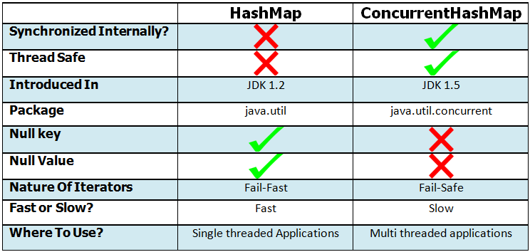

## HashMap과 ConcurrentHashMap ##
프로젝트를 하던 중 로그인 하지 않은 사용자들도 서비스를 일시적으로 이용할 수 있게 하기 위해 인증 여부에 따라 API를 구분해줌.

처음에는 로그인 하지 않은 사용자들은 DB에 데이터를 저장하지 않고, HashMap을 사용해서 메모리 상에만 저장하는 방식을 사용하려고 했음.

근데 동시성 문제 때문에 HashMap 보다는 ConcurrentHashMap을 사용하는 것이 더 안전하다고 그래서 궁금증이 생김

 

출처: https://javaconceptoftheday.com/hashmap-vs-concurrenthashmap-in-java/

 
 

HashMap과 ConcurrentHashMap 모두 Key-Value 형태로 데이터를 저장함

### (1) Thread Safe ###
- HashMap은 동기화를 지원하지 않아 스레드에 안전하지 않음. 따라서 멀티 스레드 환경에서는 안전하지 않을 수 있어 단일 스레드 환경에서의 사용이 적합함
- 단, Collections.synchronizedMap() 메서드를 사용하면 외부적으로 동기화 될 수 있음
- ConcurrentHashMap은 내부적으로 동기화 되어 스레드에 안전함.
따라서 멀티 스레드 환경에서 안전하게 사용할 수 있음

 

### (2) Internal Structure ###
- ConcurrentHashMap은 모든 연산에 대해 동기화 되는 것이 아니라, 추가나 삭제와 같은 수정 연산에 대해서 동기화 됨
- 읽기 연산에 대해서는 동기화 되지 않음
- Collections.synchronizedMap() 메서드를 사용해 외부적으로 동기화하는 HashMap의 경우에는 모든 연산이 동기화 되기 때문에 애플리케이션의 속도가 늦어질 수 있음 

 

### (3) Introduction Into Java Collection Framework ###
- HashMap은 JDK 1.2. 버전부터 Java Collection Framework에 포함되었음
- ConcurrentHashMap은 더 나중에 Java Collection Framework에 동시성 패키지의 일부로 포함되었음
- ConcurrentHashMap은 레거시 클래스인 HashTable의 대안으로 더 넓게 다뤄지고 있음

 

### (4) Null Keys And Null Values ###
- HashMap은 하나의 null 키와 다수의 null 값을 허용함
- ConcurrentHashMap은 null 키와 null 값도 허용하지 않음

 

### (5) Fail-Fast Vs Fail-State ###
- HashMap은 fail-fast 방식을 사용함 
  - HashMap의 Iterators는 HashMap이 Iterators를 생성하고 수정되었을 때 ConcurrentModificationException 예외가 발생함
- ConcurrentHashMap은 fail-safe 방식을 사용함
  - ConcurrentHashMap의 Iterators는 ConcurrentHashMap이 Iterators를 생성하고 수정되었을 때 어떠한 예외도 던지지 않음

 

### (6) Performance ###
- ConcurrentHashMap의 추가나 삭제 같은 연산은 동기화 되기 때문에 HashMap 보다 속도가 느림
- 읽기 작업의 경우 HashMap과 ConcurrentHashMap 동기화 되지 않기 때문에 같은 성능을 보임

 

### (7) When To Use What? ###
- ConcurrentHashMap은 내부적으로 동기화 되기 때문에 멀티 스레드 환경의 애플리케이션에 더 적합함
- HashMap은 내부적으로 동기화 되지 않기 때문에 단일 스레드 환경의 애플리케이션에 더 적합함
 
