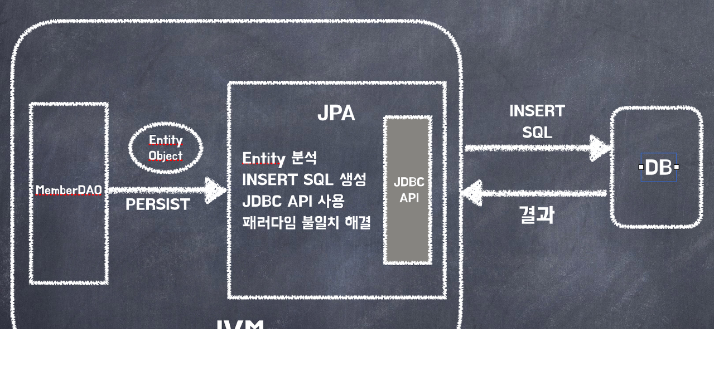
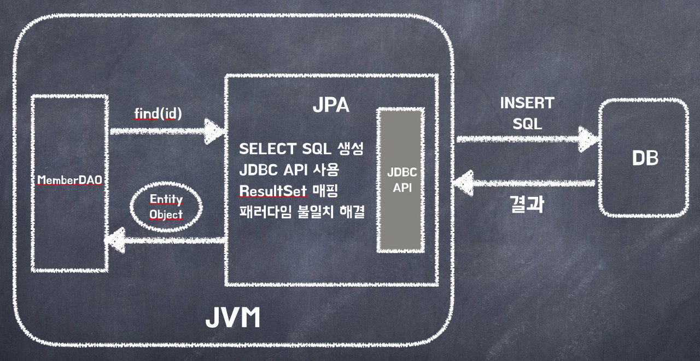

## ORM (Object Relational Mapping) ##
애플리케이션의 객체를 관계형 데이터베이스에 자동으로 영속화 해주는 기술

즉, 애플리케이션의 객체와 RDB의 테이블 간의 매핑을 자동으로 처리해주고, 둘 사이의 불일치를 해결해 줌

#### 장점 ####
- SQL을 직접 작성하는 대신 개게지향 적인 방식으로 DB 작업을 수행할 수 있어 생산성이 향상됨
- 객체 지향적인 코드 작성이 가능함

 

#### 단점 ####
- 프로젝트의 설계가 잘못된 경우, 성능저하가 발생할 수 있음 <b style="color:skyblue">(N+1 문제)</b>
- 복잡하고 무거운 쿼리는 속도를 위해 별도의 튜닝이 필요하므로 결국 SQL을 사용할 수 있음

 
 

## JPA (Java Persistence API) ##
자바에서 사용하는 ORM 기술 표준으로 ORM을 사용하기 위한 <b style="color:orange">인터페이스들의 모음</b>
- 인터페이스이므로 Hibernate, Open JPA 등의 구현체가 존재함

JPA는 애플리케이션과 JDBC 사이에서 동작하며 JDBC API를 사용해 SQL을 호출하고 DB와 통신함

JPA는 반복적인 CRUD 작업을 빠르게 처리할 수 있음

또한, SQL이 아닌 객체 중심으로 개발할 수 있음

 
 

### Hibernate ###
ORM 프레임워크이자 JPA의 구현체

ORM에 특화되어 있어, 복잡한 데이터 모델을 쉽게 관리하고 매핑할 수 있음

엔티티 저장 (EntityManager.persist)

엔티티 조회 (EntityManger.find)

 

<b style="color:orange">※ JPA는 수정 메서드를 제공하지 않음</b>
- JPA는 수정할 엔티티 객체를 조회하고, 해당 엔티티의 속성을 변경하여 트랜잭션이 커밋될 때 변경된 내용을 DB에 저장하기 위해 자동으로 UPDATE문을 생성해서 실행함

 
 

### Spring Data JPA ###
ORM 프레임워크이자 JPA에 대한 데이터 접근의 추상화

데이터 액세스를 간소화하고, Repository 패턴을 기반으로 하여 CRUD 작업을 쉽게 처리할 수 있음

Spring Data JPA를 사용하기 위해서는 Hibernate, Eclipse Link 등의 JPA Provider가 필요함 

spring-boot-starter-data-jpa을 추가하면 <b style="color:orange">기본적으로 Hibernate가 JPA Provider로 설정</b>되기 때문에 명시적으로 지정할 필요는 없음