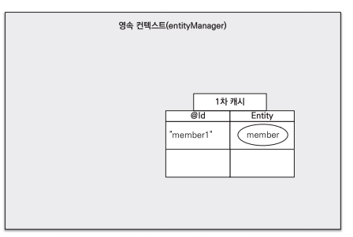

## 엔티티 매니저 (Entity Manager) ##
엔티티를 관리해 애플리케이션과 데이터베이스 사이에서 객체를 생성, 수정, 삭제하는 역할을 수행

이런 엔티티 매니저를 생성하는 곳이 엔티티 매니저 팩토리 (Entity Manager Factory)라 함

- 엔티티 매니저 팩토리는 애플리케이션과 데이터베이스 중 애플리케이션에 속해서 관리되며, 데이터베이스와의 연결 정보를 갖고 있음
- 엔티티 매니저 팩토리는 엔티티 매니저를 생성하면서 스레드 안전성을 보장하므로 여러 스레드에서 동시에 접근할 수 있음
- 반면, 엔티티 매니저는 여러 스레드가 동시에 접근하면 동시성 문제가 발생할 수 있으므로 일반적으로 요청이 오면 엔티티 매니저 팩토리가 엔티티 매니저를 생성하는 방식으로 동작함
- 스프링부트는 엔티티 매니저 팩토리를 하나만 생성해서 관리하고<b style="color:orange">(싱글톤)</b>, @PersistenceContext 또는 @Autowired 어노테이션을 통해 엔티티 매니저를 사용함

```
@PersistenceContext
private EntityManager em;  // 프록시 객체로 필요할 때 진짜 엔티티 매니저 객체를 호출함
```
- 엔티티 매니저는 상태를 가지기 때문에 Thread-Safe하지 않음
- 따라서 각 스레드에서 개별적으로 엔티티 매니저 인스턴스를 사용하는 것이 중요한데, 이를 위해 @PersistenceContext를 통해 프록시를 제공하며, 요청 시 적절한 엔티티 매니저를 주입함

<br />
<br />

## 영속성 컨텍스트 (Persistence Context) ##
엔티티 매니저는 엔티티를 영속성 컨텍스트에 저장하는데, 영속성 컨텍스트는 직접 접근이 불가능하고 엔티티 매니저를 통해서만 접근이 가능함

이를 위해 <b>1차 캐시</b>, <b>SQL 쓰기 지연 저장소</b>, <b>변경 감지</b>, <b>지연 로딩</b>과 같은 특징이 있음


### 1차 캐시 ###

영속성 컨텍스트는 내부에 Map 형태로 된 1차 캐시를 갖고 있음
- key는 @Id로 선언한 필드로 DB의 기본키와 매핑되며, value는 엔티티의 인스턴스임
- 엔티티를 조회할 때 1차 캐시에서 데이터를 조회하고 값이 있으면 반환, 없으면 DB에서 조회하여 1차 캐시에 저장한 다음에 반환함
- 이를 통해 DB 접근을 줄이고, 조회 속도를 향상시킬 수 있음
- 또한, 같은 엔티티를 조회할 경우, 1차 캐시에서 동일한 인스턴스를 반환하므로 동일성을 보장함 
```
@PersistenceContext
EntityManager em;  // 프록시 객체

// 비영속 상태
Member member = new Member();
member.setId("memberId");

// 실제 엔티티 매니저 객체에 접근
em.persist(member); // 영속 상태로 전환 - 1차 캐시에 저장되었지만 커밋되지 않았기 때문에 DB에 저장되지 않은 상태

em.find(Member.class, member.getId());  // 영속 상태이므로 동일한 객체를 1차 캐시에서 조회해서 반환
```

<br />

### SQL 쓰기 지연 저장소 ###
엔티티 매니저는 트랜잭션을 커밋하기 전까지 DB에 Insert, Update, Delete와 같은 쓰기 쿼리문을 보내지 않고 쿼리 저장소에 SQL을 모아 두었다가 트랜잭션을 커밋할 때 모아둔 쿼리를 한 번에 보내게 됨
- 쓰기 지연을 하게 되면 엔티티의 상태가 변경될 때마다 즉시 쿼리를 실행하는 대신, 변경 사항을 모아서 한 번에 처리함으로써 불필요한 DB 접근을 줄일 수 있음
- 또한, 여러 데이터 변경 작업이 하나의 트랜잭션으로 묶여서 실행되므로, 모두 반영되거나 롤백되어 데이터의 무결성을 유지할 수 있음
```
@PersistenceContext
EntityManager em;

EntityTransaction et = em.getTransaction();
et.begin();  // 트랜잭션 시작

Member member = new Member();
member.setId("memberId");

em.persist(member);  // member 엔티티를 1차 캐시에 저장하면서 쓰기 지연 저장소에 Insert 쿼리를 저장

et.commit();  // 트랜잭션 커밋 - 쓰기 지연 저장소에 모인 쿼리를 DB에 전달하여 실제 DB에 반영
```

<br />

#### flush ####
flush는 영속성 컨텍스트의 변경 내용을 DB에 반영하는 것으로 트랜잭션이 커밋되기 전에 em.flush()를 호출하면 영속성 컨텍스트에 있는 모든 변경 사항이 즉시 DB에 반영됨

이를 통해 트랜잭션이 커밋되기 전에 상태를 동기화하고자 할 때 유용함

- 변경 감지를 통해 영속성 컨텍스트의 모든 엔티티를 스냅샷과 비교해 변경된 엔티티를 찾고<b style="color:orange">(Dirty Checking)</b>, 변경된 엔티티는 쿼리를 만들어 쓰기 지연 저장소에 저장하고 저장된 쿼리를 DB에 전달함
- JPA가 트랜잭션을 커밋할 때 flush를 자동으로 호출함
  - 또는 JQL 쿼리 실행 시 자동으로 호출함
```
@PersistenceContext
EntityManager em;

Member member = new Member();
member.setId("memberId");

TypedQuery query = em.createQuery("select m from Member m", Member.class);

List<Member> memberList = query.getResultList();  // member 객체를 영속 상태로 만들었지만, DB에 반영되지 않았기 때문에 JPQL 실행 시 자동으로 flush가 호출되어 영속성 컨텍스트의 변경 사항이 DB에 반영됨

// 단, 식별자를 기준으로 조회하는 em.find() 를 호출하게 되면 flush가 실행되지 않음
```