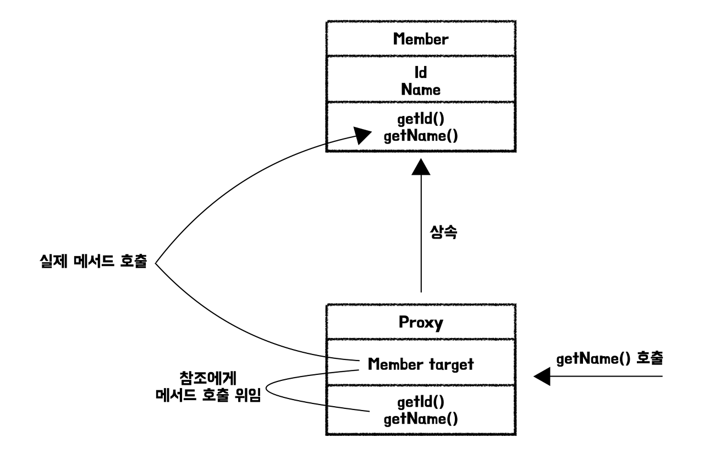

## Proxy 객체 ##
프록시란 실제 엔티티 객체 대신에 DB 조회를 지연할 수 있는 가짜 객체를 말함

실제 엔티티 클래스를 상속 받아 만들어지기 때문에 사용하는 입장에서는 진짜 객체인지 가짜 객체인지 신경 쓰지 않고 사용하면 됨


- 하나의 트랜잭션 내에서 사용되는 객체에서 지연 로딩으로 연관 관계가 매핑된 객체를 조회하려고 할 때 프록시 객체가 사용됨

- 프록시 객체는 실제 객체에 접근하지 않고 엔티티의 데이터를 조회할 수 있도록 해줌

- 프록시 객체는 <b style="color:red">실제 객체에 대한 참조</b>를 갖고 있으므로, 프록시 객체의 메서드를 호출하면 프록시 객체는 참조를 통해 메서드 호출을 위임하고 실제 객체의 메서드를 호출하게 됨

- 실제 엔티티의 데이터에 접근할 때 영속성 컨텍스트에 엔티티가 영속화 되어 있지 않으면 영속성 컨텍스트에 객체 생성을 요청하게 되는데, 이를 <b style="color:orange">프록시 초기화</b>라 함
  - 프록시 초기화는 처음 사용될 때 한 번만 초기화 됨

<br />
<br />

### 프록시 객체의 초기화 과정 ###
1. <b>프록시 객체 생성</b>
- 연관된 엔티티를 조회할 때, 데이터를 바로 로딩하지 않고 필요한 시점에 로딩하기 위해 프록시 객체를 생성함

2. <b>프록시 객체 사용</b>
- 프록시 객체의 메서드를 호출하면 실제 엔티티 객체에 위임됨
- 이 때, 실제 엔티티 데이터가 필요하므로 이 시점에 프록시 객체를 초기화 함

3. <b>프록시 객체 초기화</b>
- 프록시 객체의 초기화는 실제 엔티티의 데이터를 로딩하는 것을 말함
- 영속성 컨텍스트에서 해당 엔티티의 데이터를 찾고, 없으면 DB에서 조회한 후 영속성 컨텍스트에 저장함

<br />
<br />

### 지연 로딩 (Lazy Loading) ###
객체가 실제로 사용될 때 로딩하는 전략
```
@Transactional
public Team getTeam(Long memberId) {
  Member member = em.find(Member.class, memberId);

  Team team = member.getTeam();

  team.getName();  // 실제로 team 객체를 건드릴 때, 즉 값이 실제로 필요한 시점에 JPA가 Team에 대한 조회 쿼리를 실행함
}
```

=> 애플리케이션을 개발할 때는 모두 지연 로딩으로 설정한 후, 성능 최적화가 필요할 때에 옵션을 변경하는 것을 추천함

<br />

위 코드에서 @Transactional 어노테이션이 선언되지 않으면 발생하는 <b style="color:red">LazyInitializayionException</b>이 발생하거나, <b style="color:red">proxy [~] - no Session</b> 에러가 발생할 수 있음

proxy [~] - no Session 에러는 Hibernate에서 프록시 객체가 세션에 접근하려 할 때, 세션이 닫혀 있기 때문에 발생하는 에러임

- @Transactional 어노테이션이 선언되지 않은 상태에서 em.find(Member.class, memberId); 를 호출하고 트랜잭션이 종료되면, Hibernate 세션이 닫히게 되는데 이후, member.getTeam(); 을 호출할 때 프록시 객체는 DB에 접근할 수 없기 때문에 발생함

<br />

#### 해결 방법 ####
1. @Transactional 어노테이션 사용
2. Fetch Join 사용
3. EntityGraph 사용
