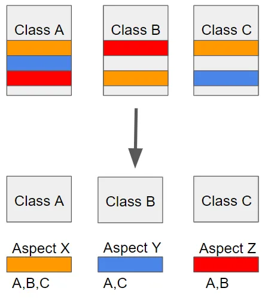

## AOP (Aspect Oriented Programming) ##
AOP는 애플리케이션 전반에 걸쳐 공통적으로 적용되는 코드들을 비즈니스 로직으로부터 분리해낸 것

AOP는 관점 지향 프로그래밍으로 애플리케이션의 핵심 비즈니스 로직과 공통 관심사를 분리하여 모듈화하는 방법임

관점 지향이란 어떤 로직을 기준으로 핵심적인 관점과 부가적인 관점으로 나누어서 관점을 기준으로 각각 모듈화하겠다는 뜻임

모듈화는 공통된 로직이나 기능을 하나의 단위로 묶는 것을 말함

예를 들어 핵심적인 관점은 비즈니스 로직이 있을 수 있고, 부가적인 관점은 핵심 로직을 실행하기 위해 행해지는 DB 연결, 로깅, 보안, 예외 처리가 될 수 있음

AOP는 흩어진 관심사를 모듈화할 수 있는 프로그래밍 기법임

 
 

위 그림에서 클래스 A의 주황색 블록을 수정해야 한다면 클래스 B, C의 주황색 블록도 일일이 찾아 수정해줘야 함

이는 객체지향 5원칙인 SOLID를 위배하며 유지보수를 어렵게 만듦

이런식으로 코드 상에서 계속 반복 사용되는 부분들을 흩어진 관심사라 함

즉, AOP에서 관점을 기준으로 로직을 모듈화한다는 뜻은 흩어진 관심사를 모듈화하겠다는 의미임

위 그림에서는 Aspect X, Aspect Y, Aspect Z처럼 모듈화 시켜놓고 어디에 적용할지만 정해주면 됨

이 때, 모듈화 한 블록은 Aspect라 함

 
 

- <b>Aspect</b>: 애플리케이션의 공통 관심사를 모듈화한 것
  - 예를 들어, 로깅, 보안, 트랜잭션 등이 해당함
- <b>Join Point</b>: 프로그램 실행 중에 Aspect를 적용할 수 있는 지점
  - 메서드 호출이나 객체 생성 등이 해당함
- <b>Point Cut</b>: 특정 Join Point를 선택하기 위한 표현식
  - 어느 Join Point에서 Aspect를 적용할지를 정의함
- <b>Target</b>: Aspect를 적용하는 곳 (클래스, 메서드)
- <b>Advice</b>: Point Cut에서 정의된 Join Point에 적용되는 행동
  - 예를 들어, 메서드 호출 전에 로깅을 추가하는 작업이 해당함
- <b>Weaving</b>: AOP를 적용하는 과정으로 코드 실행 전에 Advice를 Join Point에 결합함
  - Weaving은 컴파일 또는 런타임 시에 이루어질 수 있음

 
 

### AOP의 장점 ###
- <b>코드 재사용성</b>: 공통 관심사를 모듈화하여 코드의 중복을 줄임
- <b>유지보수 용이</b>: 관점을 분리함으로써 각 모듈을 독립적으로 수정할 수 있고, 흩어진 관심사를 한 곳에서 관리하므로 유지보수가 용이함
- <b>가독성 향상</b>: 비즈니스 로직과 공통 기능을 분리하여 코드의 가독성을 높임

 
 

### OOP와 AOP의 차이 ###
OOP (객체 지향 프로그래밍)
- 비즈니스 로직의 모듈화를 위한 접근 방식
- 모듈화의 핵심 단위는 비즈니스 로직이며, 상속을 통해 공통 기능을 재사용함
- 공통 기능을 관리하기 어려울 수 있고 코드가 복잡해질 수 있음

 

AOP (관점 지향 프로그래밍)
- 부가 기능의 모듈화를 위한 접근 방식
- 로깅, 동기화, 캐싱 등과 같은 공통 관심사를 관리
- 흩어진 관심사가 한 곳에서 관리되어 유지보수가 용이함
- 핵심 관점과 부가적인 관점이 분리되어 개발자는 핵심 관점에 집중할 수 있음

 
 

### AOP 적용 방법 ###
1. 컴파일 시 적용
- AspectJ와 같은 컴파일러를 사용하여 컴파일 시에 부가 기능 로직을 추가함

2. 클래스 로딩 시 적용
- 클래스 로더 조작을 통해 클래스 파일이 로드되기 전에 부가 기능을 추가하는 방식으로 운영이 복잡할 수 있음

3. 런타임 시 적용
- 스프링에서 AOP를 적용할 때 주로 사용하는 방법으로 프록시를 통해 부가 기능을 추가하는 방식임
- 실제 대상 코드는 그대로 유지되고, 특별한 컴파일러나 옵션, 클래스 로더 조작기가 없어도 됨
