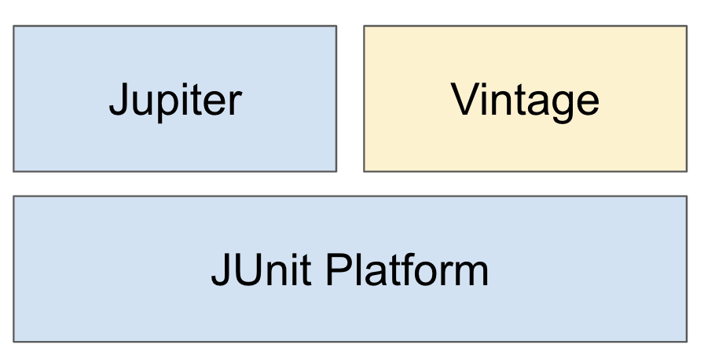

## TDD (Test-Driven Development) ##
TDD는 테스트 주도 개발로, 테스트 케이스를 먼저 작성한 후 테스트를 통과하도록 코드를 개발하는 방식임

TDD의 목적은 개발 효율성을 높이고,버그를 줄이며 깔끔한 코드를 작성하는 것에 있음

<br />

TDD의 순서는 
1. <b>테스트 케이스 작성</b>
    - 구현하고자 하는 기능에 대한 테스트 케이스를 작성함. 
    이 테스트 케이스는 실제 기능이 없기 때문에 실패해야 함
2. <b>코드 작성</b>
    - 테스트를 통과하기 위한 최소한의 프로덕션 코드를 작성함
3. <b>테스트 케이스 실행</b>
    - 테스트를 실행하여 모든 테스트가 통과되는지 확인함
4. <b>리팩토링</b>
    - 코드가 테스트를 통과하면 코드를 개선하고 최적화하기 위해 리팩토링 함
5. <b>반복</b>
    - 새로운 기능을 추가할 때마다 위 과정들을 반복함

<br />
<br />

### TDD의 장점 ###
1. 버그 예방
     - 테스트 케이스를 먼저 작성함으로써 개발 초기 단계에서 버그를 발견하고 수정해 나중에 발생하는 문제를 줄일 수 있음

2. 코드 품질 향상
    - 리팩토링을 반복하여 중복된 코드는 제거하고 반복되는 코드는 추출하여 코드가 깔끔해짐

3. 개발 속도 향상
    - 초기에는 테스트 케이스를 작성하느라 시간이 더 걸릴 수 있지만, 장기적으로 보면 TDD는 유지보수가 용이하고 기능 추가를 더 쉽게 할 수 있어 개발 속도를 향상시킴

4. 신뢰성 있는 코드
    - TDD를 통해 작성된 프로덕션 코드는 테스트를 통과해야 하므로 신뢰성 있는 코드 작성이 가능해짐

<br />
<br />

### 테스트 순서 ###
스프링에서 TDD를 위한 테스트 순서

1. Repository
    - DB 관련 테스트
    - 데이터 저장, 조회, 수정, 삭제 등의 기능이 올바르게 동작하는지 확인
    - 이를 위해 H2와 같은 인메모리 데이터베이스를 사용할 수 있음

2. Service
    - 비즈니스 로직 테스트
    - 여러 Repository를 조합하여 트랜잭션이 잘 처리되는지 등을 확인
    - 원하는 Service에 대해서만 테스트를 하려면 Mockito를 통해 Repository 등은 Mock 객체로 사용할 수 있음

3. Controller
    - 클라이언트와의 상호작용을 테스트
    - API 요청이 올바르게 처리되고, 적절한 응답을 반환하는지 확인
    - HTTP 요청과 응답, 상태 코드 등을 확인
    - 이를 위해 MockMvc를 사용할 수 있음

<br />
<br />

테스트를 작성할 때는 given, when, then 순서로 작성하는 것이 좋음

- <b>given (데이터 준비)</b>
- <b>when (테스트 실행)</b>
- <b>then (테스트 검증)</b>

<br />
<br />

## JUnit ##
JUnit은 테스트를 위한 라이브러리로 여러 개의 모듈로 구성되어 있음

JUnit 모듈은 아래와 같이 Platform 위에 Jupiter와 Vintage가 동작함



- 스프링부트 2.2 버전 이상부터는 기본적으로 JUnit 5를 지원함 (Java 8 이상)

<br />

<b>Junit Platform</b>
- 테스트를 실행할 수 있는 API를 제공함
- 테스트를 발견하고 테스트 계획을 생성하는 테스트 엔진을 가지고 있음

<b>JUnit Jupiter</b>
- Junit 5에서 테스트 및 Extension을 작성하기 위한 새로운 프로그래밍 모델과 확장 모델의 조합
- @Test, @BeforeEach, @AfterEach 등 다양한 어노테이션을 통해 테스트를 정의함
- 특정 조건에 따라 테스트를 실행하거나 생략할 수 있는 기능을 제공함

<b>JUnit Vintage</b>
- 기존에 JUnit 3 및 JUnit 4 버전으로 작성된 테스트 코드를 실행할 때 사용되는 TestEngine
- 하위 버전의 호환성을 위해 존재함

<br />
<br />

### JUnit 5의 테스트 라이프 사이클 ###
1. <b>@BeforeAll</b>
- 테스트 시작 전에 실행되어야 하는 메서드를 표현 (static으로 선언해야 함)

2. <b>@BeforeEach</b>
- 각 테스트 메서드가 시작되기 전에 실행되어야 하는 메서드를 표현

3. <b>@Test</b>
- 테스트 메서드는 @Test 어노테이션으로 표시되며, 실제 테스트 로직이 실행됨

4. <b>@AfterEach</b>
- 각 테스트 메서드가 시작된 후 실행되어야 하는 메서드를 표현

5. <b>@AfterAll</b>
- 테스트 종료 후에 실행되어야 하는 메서드를 표현 (static으로 선언해야 함)

<br />

@BeforeAll과 @AfterAll은 테스트 클래스의 모든 인스턴스가 생성되기 전과 모든 테스트가 완료된 후에 한 번만 호출되기 때문에 정적 메서드로 선언해야 함

<br />
<br />
<br />

### JUnit Main Annotations ###
<b>@SpringBootTest</b>
- 통합 테스트 용도로 사용
- 컴포넌트 스캔을 통해 모든 Bean을 로드함
- Spring ApplicationContext를 로드해서 Bean을 추가하고, MockBean을 찾아서 교체함
- 전체 Spring ApplicationContext를 로드하기 때문에 상대적으로 무겁고 시간이 오래 걸릴 수 있어 모든 Bean을 로드할 필요가 없으면 @WebMvcTest, @DataJpaTest, @MockBean 등을 사용해서 특정 컴포넌트만 로드할 수 있음

<br />

<b>@ExtendWith</b>
- JUnit 5에서 제공하는 어노테이션으로 테스트 클래스나 테스트 메서드에 특정 확장 기능을 적용할 때 사용함
- @SpringBootTest는 기본적으로 @ExtendWith가 추가되어 있음
- JUnit 4에서는 @RunWith로 사용되었음

<br />

<b>@WebMvcTest(클래스명.class)</b>
- (클래스명.class)에 작성된 클래스만 실제로 로드해서 테스트를 진행
- (클래스명.class)를 지정해주지 않으면 @Controller, @RestController, @ControllerAdvice 등 컨트롤러와 연관된 모든 Bean이 로드됨
- 스프링의 모든 Bean을 로드하는 @SpringBootTest 대신 컨트롤러 관련 코드만 테스트할 때 사용

<br />

<b>@MockBean</b>
- DI된 객체에 대해 가짜 객체를 생성해줌
- given() 메서드를 활용해서 가짜 객체의 동작을 정의할 수 있음
- @Autowired로 @MockBean을 선언하면 컨트롤러의 API를 테스트하는 용도인 MockMvc 객체를 주입 받음
- andExpect(), andDo(), andReturn() 등의 메서드를 같이 활용함

<br />

<b>@AutoConfigureMockMvc</b>
- spring.test.mockmvc의 설정을 로드하면서 MockMvc의 의존성을 자동으로 주입해줌
- MockMvc로 Rest API 테스트를 할 수 있음

<br />

<b>@Import</b>
- 필요한 클래스를 Configuration으로 만들어서 사용할 수 있음
- Import 된 클래스는 DI가 가능함

<br />

<b>@DataJpaTest</b>
- JPA 관련 컴포넌트를 테스트하기 위한 어노테이션
- 기본적으로 H2 DB와 함께 사용되며 실제 DB와 유사한 환경에서 테스트할 수 있음
- 테스트 메서드가 실행될 때마다 트랜잭션이 생성되고 테스트가 완료된 후에 롤백됨

<br />

<b>@DataR2dbcTest</b>
- R2DBC 관련 컴포넌트를 테스트하기 위한 어노테이션
- @DataJpaTest와 비슷한 역할을 하지만, 비동기적으로 데이터베이스와 상호작용하는 테스트를 수행함

<br />
<br />

JUnit 5를 사용한 테스트 코드 예시 (Spring MVC)

```Java
@DataJpaTest    // 테스트가 끝나면 롤백
class MemberRepositoryTest {
    @Autowired
    private MemberRepository memberRepository;

    @Test
    @DisplayName("Member 저장 테스트")
    void save() {
        // given
        Member member1 = Member.builder()
                .nickname("tester001")
                .age(25)
                .gender("Male")
                .build();

        Member member2 = Member.builder()
                .nickname("tester002")
                .age(22)
                .gender("Female")
                .build();

        // when
        Member savedMember1 = memberRepository.save(member1);
        Member savedMember2 = memberRepository.save(member2);

        // then
        Assertions.assertThat(savedMember1.getNickname()).isEqualTo(member1.getNickname());
        Assertions.assertThat(savedMember1.getGender()).isEqualTo(member1.getGender());
        Assertions.assertThat(savedMember2.getNickname()).isEqualTo(member2.getNickname());
        Assertions.assertThat(savedMember2.getGender()).isEqualTo(member2.getGender());
    }

    @Test
    @DisplayName("Member 조회 테스트")
    void findById() {
        // given
        Member member = Member.builder()
                .nickname("tester001")
                .age(25)
                .gender("Male")
                .build();

        Member savedMember = memberRepository.save(member);

        // when
        Optional<Member> findMember = memberRepository.findById(savedMember.getId());

        // then
        Assertions.assertThat(findMember).isNotEmpty();
        Assertions.assertThat(findMember.get().getNickname()).isEqualTo(member.getNickname());
    }
}

@ExtendWith(SpringExtension.class)
@Import(MemberService.class)
class MemberServiceTest {
    @Autowired
    private MemberService memberService;

    @MockBean
    private MemberRepository memberRepository;

    @MockBean
    private BCryptPasswordEncoder passwordEncoder;

    @MockBean
    private TokenProvider TokenProvider;

    @MockBean
    private AuthenticationManagerBuilder authenticationManagerBuilder;

    @MockBean
    private AuthenticationManager authenticationManager;

    @MockBean
    private RedisTemplate<String, String> redisTemplate;

    @MockBean
    private ValueOperations<String, String> valueOperations;

    @BeforeEach
    void setup() {
        when(authenticationManagerBuilder.getObject()).thenReturn(authenticationManager);
        when(authenticationManager.authenticate(any())).thenReturn(new TestingAuthenticationToken("user", "password", "ROLE_USER"));

        valueOperations = mock(ValueOperations.class);
        when(redisTemplate.opsForValue()).thenReturn(valueOperations);
    }

    @Test
    @DisplayName("회원가입 테스트")
    void signUp() {
        // given
        JoinReq joinReq = new JoinReq("testId", "1234", "tester001");   // 로그인 id, 비밀번호, 닉네임

        // when
        memberService.login(joinReq);

        // then
        verify(memberRepository, times(1)).save(any(Member.class));
    }

    @Test
    @DisplayName("로그인 테스트")
    void signIn() {
        // given
        String loginId = "testId";
        String password = "1234";
        String accessToken = "accessToken";
        String refreshToken = "refreshToken";
        long REFRESH_TOKEN_EXPIRE_TIME = 1000 *60 * 60 * 24 * 7;

        LoginReq loginReq = new LoginReq(loginId, password);
        TokenDTO tokenDTO = new TokenDTO(accessToken, refreshToken);

        UsernamePasswordAuthenticationToken authetnicationToken = new UsernamePasswordAuthenticationToken(loginReq.getLoginId(), loginReq.getPassword());
        Authentication authentication = mock(Authentication.class);

        // when
        when(authenticationManager.authenticate(authetnicationToken)).thenReturn(authentication);
        when(authentication.getName()).thenReturn(loginReq.getLoginId());
        when(tokenProvider.generateToken(authentication)).thenReturn(tokenDTO);
        when(tokenProvider.getExpiration(tokenDTO.getRefreshToken())).thenReturn(REFRESH_TOKEN_EXPIRE_TIME);

        TokenDTO loginTokenDTO = memberService.login(loginReq);

        // then
        Assertions.assertThat(loginTokenDTO.getAccessToken()).isEqualTo(tokenDTO.getAccessToken());
        Assertions.assertThat(loginTokenDTO.getRefreshToken()).isEqualTo(tokenDTO.getRefreshToken());

        verify(valueOperations, times(1)).set(
            eq(authentication.getName()),
            eq(tokenDTO.getRefreshToken()),
            eq(REFRESH_TOKEN_EXPIRE_TIME),
            eq(TimeUnit.MILLISECONDS)
        );
    }
}

@WithMockUser
@WebMvcTest(MemberController.class) // SpringBootWebSecurityConfiguration을 불러옴 (formLogin().and().httpBasic())
// 그렇기 때문에 @WithMockUser가 없으면 401 에러가 발생함
class MemberControllerTest {
    @Autowired
    private MockMvc mockMvc;

    @Autowired
    ObjectMapper objectMapper;

    @MockBean
    MemberService memberService;

    @Test
    @DisplayName("회원가입 테스트")
    void signUp() throws Exception {
        // given
        JoinReq joinReq = new JoinReq("testId", "1234", "tester001")    // 로그인 id, 비밀번호, 닉네임

        // when
        mockMvc.perform(post("/auth").with(csrf())  // 권한 문제로 csrf()가 없으면 403 에러 발생
                .contentType(MediaType.APPLICATION_JSON)
                .content(objectMapper.writeValueAsString(joinReq))
        ).andExpect(status().isOk());

        // then
        verify(memberService).signUp(Mockito.any(JoinReq.class));   // 해당 메서드가 예상대로 호출되었는지 확인
    }

    @Test
    @DisplayName("로그인 테스트")
    void signIn() throws Exception {
        // given
        LoginReq loginReq = new LoginReq("testId", "1234");
        TokenDTO tokenDTO = new TokenDTO("accessToken", "refreshToken");

        // when
        Mockito.when(memberService.signIn(Mockito.any(LoginReq.class))).thenReturn(tokenDTO);

        mockMvc.perform(post("/auth/login").with(csrf())
                .contentType(MediaType.APPLICATION_JSON)
                .content(objectMapper.writeValueAsString(loginReq))
        ).andExpect(status().isOk());

        // then
        verify(memberService).signIn(Mockito.any(LoginReq.class));
    }
}
```

<br />
(Spring Webflux)

```Java
@DataR2DbcTest
class MemberRepositoryTest {
    private MemberRepository memberRepository;
    private DatabaseClient databaseClient;
    private TransactionalOperator transactionalOperator;
    private DatabaseClient.GenericExecuteSpec executeSpec;
    private FetchSpec<Map<String, Object>> fetchSpec;

    private Member member;

    @BeforeEach
    void setup() {
        member = Member.builder()
                .id(1L)
                .loginId("testId")
                .password("1234")
                .nickname("tester001")
                .build();

        databaseClient = mock(DatabaseClient.class);
        transactionalOperator = mock(TransactionalOperator.class);
        executeSpec = mock(DatabaseClient.GenericExecuteSpec.class);
        fetchSpec = mock(FetchSpec.class);

        // transactional 메서드가 호출될 때마다 인자로 전해지는 Mono 객체를 그대로 반환하도록 함
        when(transactionalOperator.transactional(any(Mono.class))).thenAnswer(invocation -> invocation.getArgument(0));
        when(databaseClient.sql(anyString())).thenReturn(executeSpec);
        when(executeSpec.bind(anyString(), any())).thenReturn(executeSpec);
        when(executeSpec.fetch()).thenReturn(fetchSpec);

        memberRepository = new MemberRepository(databaseClient, transactionalOperator);
    }

    @Test
    @DisplayName("Member 저장")
    void save() {
        // given

        // when
        when(fetchSpec.one()).thenReturn(Mono.just(Map.of("member_id", member.getMemberId())));
        when(fetchSpec.rowsUpdated()).thenReturn(Mono.just(1L));

        StepVerifier.create(memberRepository.save(member))
                .verifyComplete();

        // then
        verify(databaseClient, atLeastOnce()).sql(anyString());
    }
}

@ExtendWith(SpringExtension.class)
@Import(MemberService.class)
class MemberServiceTest {
    @Autowired
    private MemberService memberService;

    @MockBean
    private MemberRepository memberRepository;

    @MockBean
    private BCryptPasswordEncoder passwordEncoder;

    @MockBean
    private ReactiveAuthenticationManager authenticationManager;

    @MockBean
    private TokenProvider tokenProvider;

    @MockBean
    private ReactiveRedisTemplate<String, String> reactiveRedisTemplate;

    @MockBean
    private ReactiveValueOperations<String, String> reactiveValueOperations;

    @BeforeEach
    void setup() {
        when(authenticationManager.authenticate(any())).thenReturn(Mono.just(new TestingAuthenticationToken("user", "password", "ROLE_USER")));

        reactiveValueOperations = mock(ReactiveValueOperations.class);
        when(reactiveRedisTemplate.opsForValue()).thenReturn(reactiveValueOperations);
        when(reactiveValueOperations.set(anyString(), anyString(), any(Duration.class))).thenReturn(Mono.just(true));
    }

    @Test
    @DisplayName("회원가입 테스트")
    void register() {
        // given
        JoinReq joinReq = new JoinReq("testId", "1234", "tester001");   // 로그인 아이디, 비밀번호, 닉네임

        // when
        memberService.register(joinReq);

        // then
        verify(memberRepository, times(1)).save(any(Member.class));
    }

    @Test
    @DisplayName("로그인 테스트")
    void login() {
        // given
        LoginReq loginReq = new LoginReq("testId", "1234");
        String accessToken = "accessToken";
        String refreshToken = "refreshToken";
        TokenDTO tokenDTO = new TokenDTO(accessToken, refreshToken);

        Authentication authentication = mock(Authentication.class);

        // when
        when(authenticationManager.authenticate(any())).thenReturn(Mono.just(authentication));
        when(authetnication.getName()).thenReturn(loginReq.getName());
        when(tokenProvider.generateToken(authentication)).thenReturn(Mono.just(tokenDTO));
        
        StepVerifier.create(memberService.login(loginReq))
                .expectNextMatches(token -> token.getAccessToken().equals(tokenDTO.getAccessToken())
                        && token.getRefreshToken().equals(tokenDTO.getRefreshToken())
                ).verifyComplete();

        // then
        verify(reactiveValueOperations, times(1)).set(eq(authentication.getName()), eq(tokenDTO.getRefreshToken()), any(Duration.class));
    }
}

@WithMockUser
@WebFluxTest(MemberController.class)
class MemberControllerTest {
    @Autowired
    private WebTestClient WebTestClient;

    @MockBean
    private MemberService memberService;

    @MockBean
    private TokenProvider tokenProvider;

    @MockBean
    private ReactiveRedisTemplate<String, String> reactiveRedisTemplate;

    @Test
    @DisplayName("회원가입 테스트")
    void register() {
        // given
        JoinReq joinReq = new JoinReq("testId", "1234", "tester001");   // 로그인 아이디, 비밀번호, 닉네임

        // when
        webTestClient.mutateWith(csrf())
                .post()
                .uri("/auth")
                .contentType(MediaType.APPLICATION_JSON)
                .bodyValue(joinReq)
                .exchange()
                .expectStatus().isOk()
                .expectBody(Void.class);

        // then
        verify(memberService).register(any(JoinReq.class));
    }

    @Test
    @DisplayName("로그인 테스트")
    void login() {
        // given
        LoginReq loginReq = new LoginReq("testId", "1234");
        TokenDTO tokenDTO = new TokenDTO("accessToken", "refreshToken");

        // when
        when(memberService.login(any(LoginReq.class))).thenReturn(Mono.just(tokenDTO));

        WebTestClient.mutateWith(csrf())
                .post()
                .uri("/auth/login")
                .contentType(MediaType.APPLICATION_JSON)
                .bodyValue(loginReq)
                .exchange()
                .expectStatus().isOk()
                .expectHeader().exists("Authorization")
                .expectHeader().valueEquals("Authorization", "Bearer " + tokenDTO.getAccessToken())
                .expectHeader().valueEquals("RefreshToken", tokenDTO.getRefreshToken());

        // then
        verify(memberService).login(any(LoginReq.class));
    }
}
```

<br />
<br />
<br />

### 단위 테스트와 통합 테스트 ###
<b>단위 테스트</b>
- 단위 테스트는 애플리케이션의 가장 작은 단위인 메서드나 클래스의 동작을 검증하는 테스트
- 각 테스트는 다른 테스트와 독립적으로 실행되며, 테스트 간 의존성이 없어야 함
- 코드의 특정 모듈이 의도한 대로 동작하는지 확인할 수 있음

<b>통합 테스트</b>
- 여러 기능을 조합하여 전체 비즈니스 로직이 제대로 동작하는지 확인하는 테스트
- 실제 DB, 메시지 큐와 같은 실제 환경에서 수행됨
- 시스템의 전체적인 흐름과 기능을 검증하는 데 중점을 둠