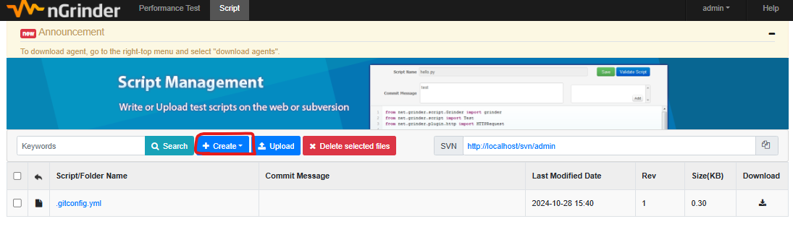

## 성능 테스트 ##
성능테스트는 애플리케이션의 성능을 평가하고, 특정 조건에서 얼마나 잘 동작하는지를 측정하는 과정임

<br />

### 성능 테스트의 목표 ###
1. 처리량 측정
    - 애플리케이션이 동시에 몇 명의 사용자를 처리할 수 있는지를 확인하면서 시스템의 최대 용량을 파악할 수 있음
2. 응답 시간 평가
    - 사용자의 요청에 대한 응답 속도를 측정하여, 사용자가 느끼는 성능을 개선할 수 있음
3. 병목 현상 발견
    - 시스템의 특정 부분에서 성능이 저하되는 지점을 찾아낼 수 있음
4. 신뢰성 및 가용성 확인
    - 다양한 조건에서 시스템이 안정적으로 작동하는지 확인하고 중단 없이 서비스가 계속 제공될 수 있도록 함

<br />

### 성능 지표 ###
- <b>처리량 (Throughput)</b>
  - 단위 시간당 처리할 수 있는 요청의 수를 의미함
  - 초당 처리되는 트랜잭션 수인 TPS (Transaction Per Second)가 있음
- <b>응답 시간 (Response Time)</b>
  - 사용자가 요청을 보낸 시점부터 응답을 받기까지 걸리는 시간
  - 평균 응답 시간 외에도 최대, 최소 응답 시간을 함께 측정해서 시스템의 일관성을 평가할 수 있음
- <b>동시 사용자 수 (Concurrent Users)</b>
  - 동시에 시스템에 접속해서 작업을 수행할 수 있는 사용자 수를 의미함
  - 시스템의 부하 처리 능력을 평가할 수 있음
- <b>자원 사용률 (Resource Utilization)</b>
  - CPU, 메모리, 디스크I/O 등 시스템 자원의 사용 정도를 측정함
  - 자원 사용률이 높으면 시스템 성능에 영향을 미칠 수 있으므로 모니터링이 필요함

<br />
<br />

## nGrinder ##
네이버에서 제작한 성능 테스트 및 부하 테스트를 위한 오픈소스 도구로, 성능 지표 확인을 위한 부하를 발생시키는 도구임

스크립트를 작성해 테스트를 진행할 수 있으며, Web UI를 통해 사용하기도 간편함

Controller가 tomcat이 필요하지만, docker에서도 사용 가능함

<br />

#### Controller ####
- 테스트를 위한 스크립트를 작성하여 테스트 환경을 구성하고, Agent에 부하 발생 명령을 해서 테스트 실행을 지시함
- 테스트 진행 중 실시간으로 성능 지표를 모니터링하고, 결과를 수집함
- 테스트 완료 후 수집된 데이터를 분석하여 성능 지표를 시각화해서 보여줌

<br />

#### Agent ####
- 실제 부하를 생성하는 역할로, Controller의 지시에 따라 테스트를 실행함
- Controller로부터 받은 테스트 시나리오에 따라 가상의 사용자(vUser)를 생성해 요청을 전송함
- 테스트 중 발생한 성능 데이터를 수집하고, 이를 Contrller에 전달함
- 여러 Agent를 사용하여 분산 환경에서 부하 테스트를 진행할 수 있음
- 통상 <b style="color: orange">vUser의 수 = 프로세스 수 x 스레드 수</b> 로 계산함

<br />

### 설치 방법 ###
아래 GitHub에서 Controller의 war 파일을 다운로드 해서 설치하는 방법이 있음

https://github.com/naver/ngrinder/releases

하지만 Controller 실행 시 tomcat이 필요하기 때문에 위 방법 대신 docker를 이용해서 실행하기로 함

docker에서 nGrinder를 실행하려면 우선 Contrller와 Agent를 pull해야 함

<br />

<b>Controller</b>
```docker
1. docker pull ngrinder/controller
2. docker run -d -v ~/ngriner-controller:/opt/ngriner-controller --name controller -p 80:80 ~p 16001:16001 -p 12000-12009:12000-12009 ngrinder/controller
```

<br />

- 80:80 - Web UI를 접속할 수 있도록 하는 포트(http://localhost)
- 16001:16001 - nGrinder의 API에 접근하기 위한 포트로, 외부 시스템이나 다른 서비스와의 통합을 위해 사용됨
- 12000-12009:12000-12009 - Agent와 Controller 간의 통신을 위해 사용되는 포트로 Agent가 Controller로부터 테스트 지시를 받고, 결과를 전달하는 데 필요한 포트

<br />

<b>Agent</b>
```docker
1. docker pull ngrinder/agent
2. docker run -d --name agent --link controller:controller ngrinder/agent
```

<br />
<br />

http://localhost 를 통해 nGriner 웹페이지로 접속이 가능함

기본 id/pw는 admin/admin로 로그인 하면


nGinrder 메인 페이지로 이동하게 됨

위에 Performance Test와 Script 메뉴가 있는데 Script 메뉴로 들어가면 테스트 할 스크립트를 작성할 수 있음



Script Name은 자바의 경우 Groovy 선택 & 스크립트 명을 작성해주면 되고,
URL to be tested의 경우 GET/POST를 지원하며, URL에는 본인 PC나 테스트 할 서버의 IP주소를 입력해주면 됨 (localhost 혹은 127.0.0.1은 불가)
Show Advanced Configuration을 통해 Headers, Cookies, Params를 추가적으로 지정해줄 수 있음

스크립트 생성 후 우측 상단의 Validate를 통해 테스트 스크립트를 검증할 수 있음


<br />
<br />

Performance Test 메뉴를 클릭하고, 


Create Test를 통해 위에서 작성한 스크립트를 불러와 성능 테스트를 진행할 수 있음


<br />

#### Basic Configuration ####
- <b>Agent</b>: 테스트에 사용할 Agent 수
- <b>Vuser per agent</b>: 테스트에서 동시에 접속하는 가상 사용자의 수로 Vuser = Agent의 수 x Process의 수 x Thread의 수
- <b>Script: 테스트에 사용할 스크립트</b>
- <b>Target Host: 테스트 대상 호스트의 IP와 도메인 주소</b>
- <b>Duration: 테스트를 수행할 시간</b>
- <b>Run Count: 테스트 수행 횟수</b>

<br />

#### Ramp-Up ####
- <b>Enable Ramp-Up</b>: 테스트를 수행하면서 Vuser를 조금씩 늘려 갈 때 사용
  - Enable Ramp-Up 사용 시 Process와 Thread를 선택할 수 있는데 Thread 선택이 권장됨
  - X축: 시간 / Y축: 동시 접속자 수
- <b>Initial Count</b>: 초기 가상 사용자 수
- <b>Incremental Step</b>: Process나 Thread를 Interval 주기마다 얼마나 증가시킬지
- <b>Initial Sleep Time</b>: 초기 대기 시간으로 테스트를 언제부터 수행할지
- <b>Interval</b>: Process나 Thread를 증가시킬 주기

<br />

ex) vuser = 99 일 때,

