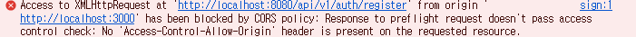
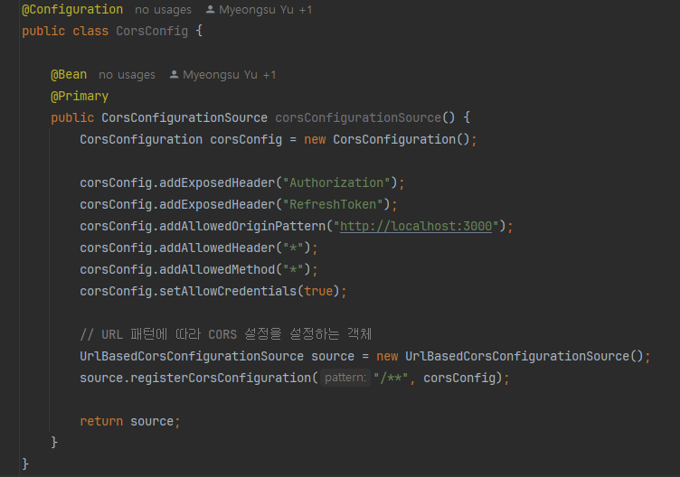
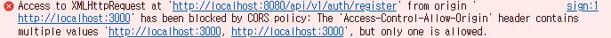

## SOP (Same Origin Policy) ## 
SOP는 동일 출처 정책이라는 보안 정책으로 한 출처(Origin)에서 로드된 리소스에 대해 동일한 출처에서만 접근 가능

#### 그렇다면 Origin이란? ####
http://localhost:8080/check-email?email=test@test.com 과 같은 URL이 있을 때, 구성은 아래와 같다.

<b>protocol</b>: http
<br />
<b>domain(host)</b>: localhost
<br />
<b>port</b>: 8080
<br />
<b>path</b>: check-email
<br />
<b>query string</b>: email=test@test.com
<br />
<br />

여기서 동일한 출처라는 말은 protocol, domain, port이 동일한 경우를 말한다.

SOP를 사용하는 이유는 출처가 다른 서버간에 리소스를 공유하는 데 아무런 제약이 없다면 CSRF, XSS 공격에 취약하기 때문이다.

따라서 대부분의 브라우저는 동일한 출처에 대해서만 리소스 공유를 허용하는 SOP 정책을 고수하고 있다.

하지만 SOP로인해 프론트엔드와 백엔드 서버 간에 리소스 공유가 허용되지 않기 때문에 이러한 경우에 필요한 것이 CORS이다.

<br />
<br />

## CORS (Cross-Origin Resource Sharing) ##
CORS는 교차 출처 리소스 공유로 SOP의 제한을 완화하기 위함

CORS는 특정 조건을 만족하는 경우 다른 출처의 리소스를 공유하는 것을 허용하는 HTTP 헤더 집합이다.

<br />

### CORS의 동작 방식 ###
예를 들어, 브라우저가 서버에 요청을 보낼 때, 서버의 출처와 브라우저의 출처가 다르면 CORS 정책이 적용됨

#### 단순 요청의 경우) ####
- GET, POST, HEAD 중 하나의 메서드를 사용할 때
- Content-Type이 application/x-www-form-urlencoded, multipart/form-data, text/plain인 경우
- 서버는 응답 헤더에 Access-Control-Allow-Origin을 포함해서 CORS 요청이 유효한지 알려줌
```
Access-Control-Allow-Origin: http://localhost:3000
```

<br/>

#### Preflight 요청의 경우) ####
단순 요청이 아닌 (PUT, DELETE 요청이거나 Content-Type이 application/json) 경우, 브라우저는 먼저 Preflight 요청을 보냄
이 요청은 OPTIONS 메서드를 사용해서 서버가 실제 요청을 허용하는지 확인하기 위함
```
OPTIONS /data HTTP/1.1
Origin: http://localhost:3000
Access-Control-Request-Method: POST
Access-Control-Request-Headers: Content-Type
```
서버는 Preflight 요청에 대해 CORS 관련 헤더를 포함해서 응답해야 함
```
Access-Control-Allow-Origin: http://localhost:3000
Access-Control-Allow-Methods: GET, POST, OPTIONS
Access-Control-Allow-Headers: Content-Type
```
Preflight 요청이 성공적으로 처리되면 브라우저는 실제 요청을 보냄
만약 서버에서 응답한 CORS 헤더가 올바르게 설정되어 있으면 응답 데이터를 사용할 수 있지만, 그렇지 않다면 브라우저는 요청을 차단함함

<br />
<br />

### 겪은 에러 ###
MSA로 개발하던 중 프론트(http://localhost:3000)에서 Gateway 서버(http://localhost:8080)으로 요청을 보낼 때 CORS 문제가 발생

이는 preflight 요청에 대한 응답에서 Access-Control-Allow-Origin 헤더가 없다는 뜻으로 Gateway서버가 http://localhost:3000에서의 요청을 허용하지 않아서 발생함

Gateway 서버가 아닌 User 서버에서 아래와 같이 CORS 설정을 하고 있었기 때문에 Gateway 서버에서 하도록 변경해줄 필요가 있었다. 


[공식문서](https://docs.spring.io/spring-cloud-gateway/docs/current/reference/html/#cors-configuration)를 살펴보니 MSA환경에서 Gateway 서버에 CORS를 적용하는 방법이 적혀있었다.
yml 파일에 아래와 같이 작성해준뒤 실행해보니
```yaml
spring:
  cloud:
    gateway:
      globalcors:
        corsConfigurations:
          '[/**]':
            allowedOrigins:
              - "http://localhost:3000"
            allow-credentials: true
            allowedHeaders:
              - Authorization
              - RefreshToken
              - Content-Type
              - x-passport
            allowedMethods:
              - POST
              - GET
              - PUT
              - PATCH
              - OPTIONS
              - DELETE
            exposedHeaders: # 없으면 응답 시 헤더 못받음
              - Authorization
              - RefreshToken
```

<br />

이번엔 이런 에러가 발생했다.



이는 동일한 경로에 대해서 하나만 허용되는데 http://localhost:3000 경로에 대해 Gateway 서버에서도 허용했고, User 서버에서도 허용했기 때문이다.

따라서 User 서버에서 작성한 CorsConfig 클래스 파일을 지우고 다시 실행하니 잘 동작한다.
